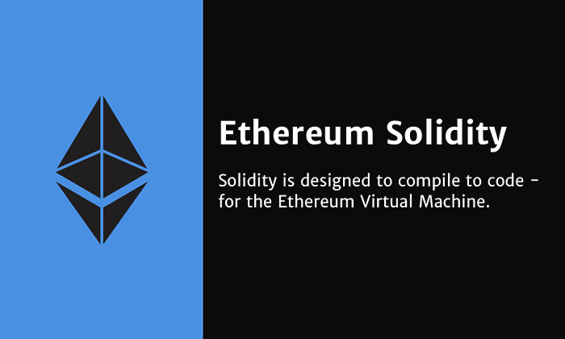
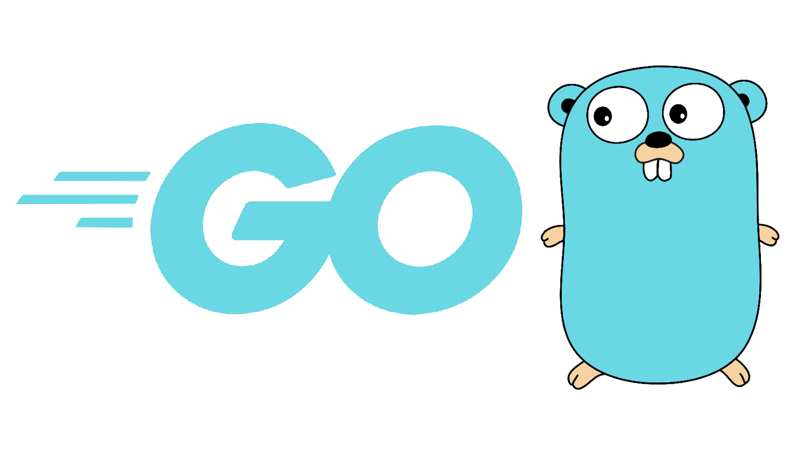
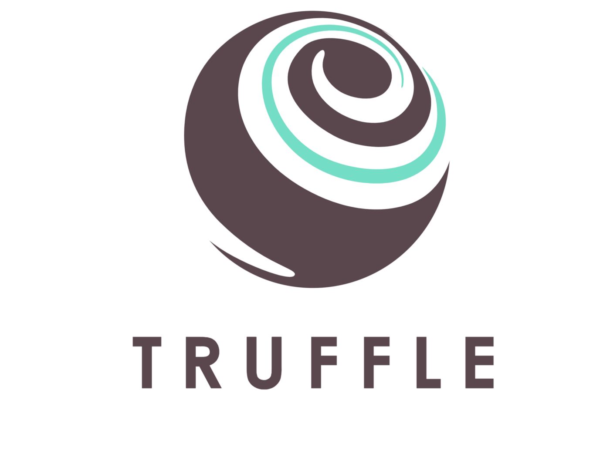
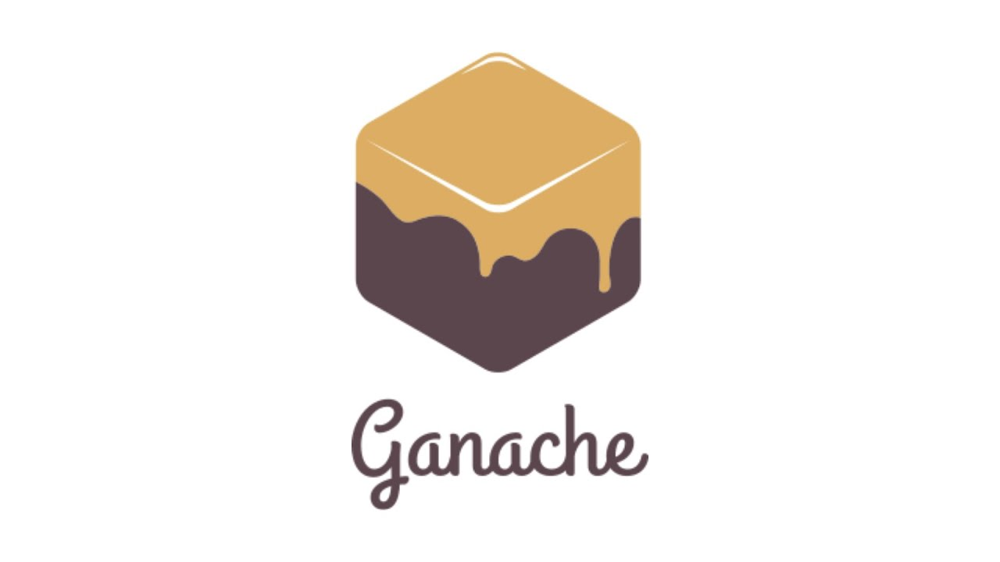

# 成为一名区块链开发者，你需要了解这些

## 进度条

- [x] 编程语言
- [ ] 开发工具

## 编程语言

不同的职业定位有不同的编程语言要求，这里列出几个主流或即将成为主流的编程语言。

### JavaScript

JavaScript是区块链入门开发者最好入手的语言，学习资料丰富，语法也比较简单。而且它在区块链开发中应用地非常广泛，`web3.js`和`ether.js`使得前端可以连接后端合约。同时大多数区块链开发语言的语法都与JavaScript类似，这使得开发者在后续学习中轻松一点。

### TypeScript

JavaScript的超集，对JavaScript进行强类型的规范，大大减少了一些代码上可能会出现的错误，使得开发更加高效安全。越来越多的巨头开始采用TypeScript。

### Solidity

区块链2.0的以太坊创建了solidity这门专用于编写智能合约的语言。solidity可以说是几乎所有合约工程师都学过的语言，你可以轻松使用solidity在以太坊（或其他EVM系区块链）上编写智能合约。

### go

以太坊本身就是采用go语言编写，go天生运行速度快与支持高并发使得它很适合用来开发区块链。不论是公链还是联盟链，go目前都是最主流的开发语言。

### Rust

可能大多数人不了解甚至没听说过这门语言，但这是笔者最看好的语言，很可能成为未来区块链开发主流语言。Rust语法严格，注重安全，在编写代码时就能规避很多漏洞，运行速度也在go之上，非常适合作为区块链开发语言。主流公链Polkadot，Solana，Near等也将Rust作为自己的主要语言，看得出大佬们很看好这门语言。不过，这门语言的学习难度较高，劝退了不少人。

### React

如果你想做一名Dapp开发者，那么你就要掌握一些前端的知识。React是一个优秀的前端框架，通过React可以轻松构建用户交互网页。现在市面上大多数的Dapp都是由React编写而成。

## 开发工具

- [ ] GETH
- [x] Truffle
- [x] Ganache

- [ ] Hardhat
- [ ] OpenZepplin

除了基本的编程语言，开发者还要熟悉常用的开发工具。

### Truffle

针对以太坊智能合约与Dapp开发的一套开发框架。提供了编译、测试和部署功能，旨在使以太坊开发变得更容易。

### Ganache

一条以太坊私有链，使得开发者可以本地模拟链上环境，方便开发、测试以及部署智能合约与Dapp，配有图形化界面，使得区块链变化更直观。